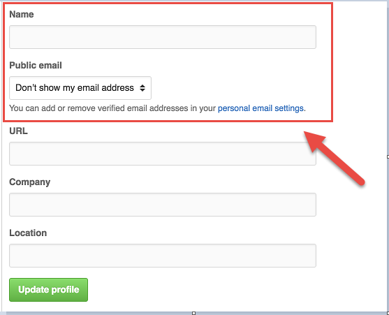
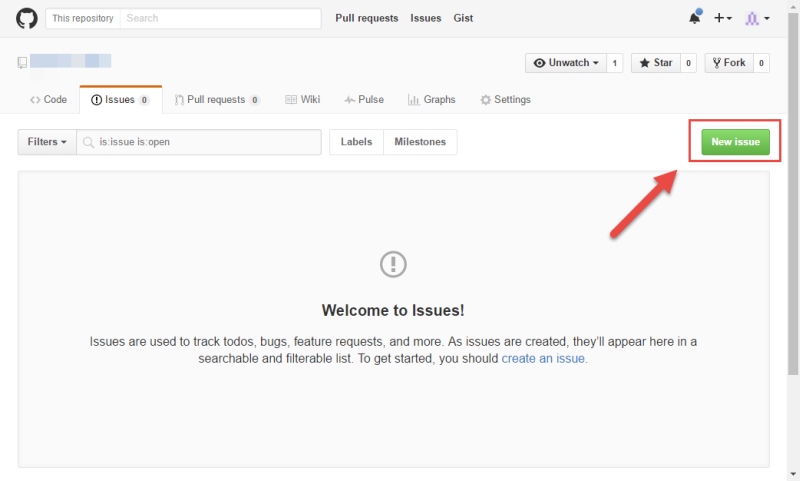
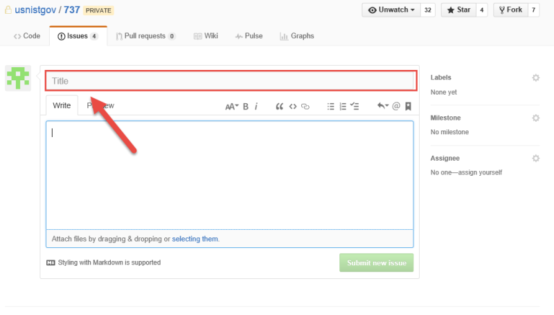
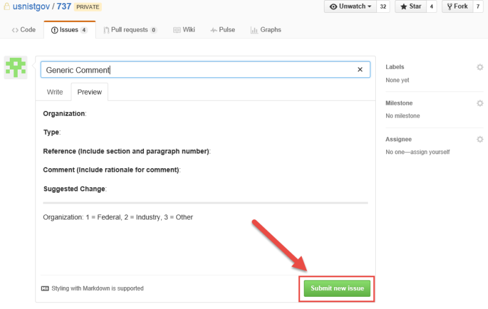

# Providing Feedback

**Review the documentation.** No account is needed to review the updated version of SOFA. Simply follow [this link](https://pages.nist.gov/SOFA/SOFA.html) and enjoy at your leisure. However, if you wish to comment you must…

1. **Establish a GitHub account.** In order to submit a comment through the GitHub “Issues” feature, you will need to create a GitHub account. This can be done by proceeding to https://github.com/join. GitHub allows you to remain pseudonymous if you would like, just make sure you select the options that suit you on the “Profile” and “Emails” pages of your “Personal Settings”.  We also highly encourage you to turn on two-factor authentication in the “Security” page, also part of “Personal Settings”.  
  

2. **Open an issue.** As you are reading and identify comments you would like to make:

    1. Click on either the "Comment" link in the sidebar navigation or the "Send Feedback" link in the footer of the page.
    
    2. Review open and closed issues to determine if a similar issue has already been created.

    2. Click on the "New Issue" button in the upper right of the screen.  
    

    4. Provide a short description in the field labelled "Title" for the feedback being provided.  
    

    5. Within the field labelled "Leave a comment", fill out the comment template and provide as much information as possible.

            **Organization**:

            **Type**:

            **Reference (Include section and paragraph number)**:

            **Comment (Include rationale for comment)**:

            **Suggested Change**:

            ---

            Organization: 1 = Federal, 2 = Industry, 3 = Other

    6. Hit “Submit New Issue” and you are done!  
    

    7. If you want to keep up with others comments through email and monitor future changes, make sure you choose to “Watch” the project!  
    

If you are familiar with github you are also welcome to provide suggestions to concrete changes as a pull request. Please provide information about organization and a rationale for suggested change.
